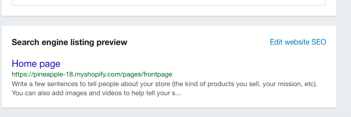
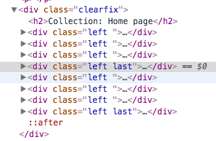

# Shopify Course Outline


## The Setup
things you need
  github account
  shopify partner account
  plain text editor
  themekit 

* Download starter theme
* Setup development store
* Setup Starter theme in development store
* Should just see ‘main page :)’
* This is found in the ‘templates/index.liquid’ file
* Setup Theme watch for local development
* Now add some words to the ‘templates/index.liquid’ file, save and see the changes in the store!
* Setup Compass for sass compilation
* Upload sample products
  * Csv upload

## 02 - The Layout - Theme.liquid
* **Brief intro to Liquid**

  Liquid is the templating language used in Shopify theme development.  It allows you to add programming logic to your theme.  It also gives you access to Shopify 'objects', things like products and blog posts that you'll want to access that are stored in your Shopify store.

   tags allow you to perform logic like if statements and loops.

  {{ }} tags allow you to display Shopify 'objects' and info about them on the page.

  We'll be showing examples of what can be done with liquid as we go through the tutorials.  But for further info you can look at our **Liquid Quick Ref**

* Bring in Header/Content
  * **Bring in stylesheets (and meta tag )**
    1. ```<meta name="viewport" content="width=device-width, initial-scale=1">```
    2. ```<title>{{ page_title}} - {{ shop.name }}</title>```
    3. ```{{ "normalize.css" | asset_url | stylesheet_tag }}```
    4. ```{{ 'styles.scss' | asset_url | stylesheet_tag }}```
    5. Wrap p tags around words ```<p> The main page :) </p>``` to make sure styles took
  * Bring in JavaScript
    1. ```{{ "option_selection.js" | shopify_asset_url | script_tag }}```
    2. ```{{ "shopify_common.js" | shopify_asset_url | script_tag }}```
    3. ```{{ "customer_area.js"  | shopify_asset_url | script_tag }}```
    4. ```{{ "//cdnjs.cloudflare.com/ajax/libs/jquery/3.1.0/jquery.min.js" | script_tag }}```
  * **Bring in the Content**
    * ```{{ content_for_layout}}```
      ```
      <div class="container">
        {{ content_for_layout}}
      </div>
      ```
    * Added blue box so you can see container
* **Shop title**
  * Our first use of Liquid templating
    * ```<h1><a href="/">{{ shop.name }}</a></h1>```
  * Bringing in an image with the asset_url
  * ``````
* **Main Menu**  
  * Linklist for main menu
    1. Go to online store/navigation, you’ll see menus.
    2. Click edit on the menu to find out the handle
    3. ```<ul>
      
       <li class="current"><a href="{{ link.url }}">{{ link.title }}</a></li>
      
        {{ content_for_layout}}
      </ul>```
  * Linklist for footer menu
    ```
    <footer>
    <ul>
    
    <li class="current"><a href="{{ link.url }}">{{ link.title }}</a></li>
    
    </ul>
    </footer>
    ```

  * shopify_asset_url
    * Returns the URL of a global assets that are found on Shopify's servers. Globally-hosted assets include:
      * option_selection.js
      * api.jquery.js
      * shopify_common.js,
      * customer_area.js
      * currencies.js
      * Customer.css


## 03 - Index.liquid
  * In the homepage page of the in the shopify panel and the bottom of the page in the Search engine listing preview section, the ‘handle’ of the page is the last bit of the url
  

  * **Front page**
    * Assign page ``````
    * Assign home_page_collection ``` ```
    * Bring in the wrapper into the index template ``` <main class="home_page">
    <div class="wrapper">```
    * Bring the main toggle into the index inside the wrapper ``` <a href="#" class="main--toggle"><span></span></a>```
    * ```<p>{{ page.title }}</p>```
    * ```<p>{{ page.content }}</p>```
    * Add google font
      * Google font 'Quicksand' ```<link href="https://fonts.googleapis.com/css?family=Quicksand" rel="stylesheet">```

    * ***Featured Collecton***
    `products -> collectons`
    * set up two collections ('single pineapples', 'multiple pinapples') -- add collection images
    * Loop through collections and unless it's the 'frontpage' collection show it 
    ```
        ```
  
  * **About page**
    * Create `templates/page.about.liquid`
    * Go to about page
    * Must save for ‘templates’ dropdown to appear
    * Add an image in the wysiwyg
    * Select page.about
    ```
    
    * Bring in the wrapper into the page.about template ``` <main class="about">
    <div class="wrapper">```
    * Bring the main toggle into the index inside the wrapper ``` <a href="#" class="main--toggle"><span></span></a>```
    <h2>{{ page.title }}</h2>
    <p>{{ page.content }}</p>
     ```
    * Add above to page.about.liquid
    * Go to admin panel - navigation and add 'About Us' to the main menu


## 04 - Snippets - product-loop.liquid
  * Got to Products / Collections / Home page
  * Add all your products to the home collection
  * Snippets! Reusable bits of code!
  ```
  
        
      
  ```
  * **Cycle** 

  

    ``

    ```
    <div class="left ">
      <div>
        <a href="{{ product.url | within: collection }}">
          
        </a>
      </div>
      <div>
        <a href="{{ product.url | within: collection }}">
            {{ product.title }}
          </a>
      </div>
      <div >
        From
        {{ product.price | money }}
      </div>
    </div>
    ```

## 05 - The Product Page - Product.liquid
  * In the products section of the Shopify admin click on one of the products.  You’ll notice there is already a title and description and a price (and maybe some variants).  This was all added when we uploaded the sample products csv.
  *  `templates/product.liquid`
  * the products featured image (code in 05-pineapple)
  * if the product has extra product shots (code in 05-pineapple)
  * Product title, cost, and description
  * navigating to previous/next product in the collection
  * If there are variants or not, select dropdown
  * A call back to check if there are variants, if it there are it checks availability. (js)
  * initialize multi selector for product (js)
  * selectCallback is a very important Javascript function that is used on the product template. Its main purpose is to split up a product’s options into multiple dropdowns, based on how many Options a product has. What’s important to know about selectCallback is that it triggers every time a user selects a different variant using the dropdowns. This means that it can be used to output information of the currently-selected variant such as price, compare at price, SKU, inventory quantity, etc. (for a full list of what can be output, seehttp://wiki.shopify.com/Variant).Notice how the price and availability of the variant now update as you select different variants from the dropdowns. That’s selectCallback at work baby!
  
## 06-a the AJAX Cart
  * `layout/theme.liquid`
  ```
  <!-- Slide-out Cart -->
  <div class="cart--quick">
    <h2>My Cart</h2>
    
      <h3>items in cart</h3>
      
        <div class="cart--product">
          <div class="cart--product-image">
            
          </div>
          <div class="cart--product-details">
            <div> 
              <h3>{{item.product.title}}</h3>
              <h3>
                
                  {{ item.variant.title }}
                
              </h3>
              <span class="price">{{ item.price | money }}</span>
            </div>
            <div class="cart--qty">

              <button type="button" class="ajaxcart__qty-adjust ajaxcart__qty--minus icon-fallback-text" data-id="{{item.id}}"  onclick="removeItem('{{ item.id }}')">
                <span class="fallback-text">&minus;</span>
              </button>

              <input type="text" name="updates[]" class="ajaxcart__qty-num" value="{{item.quantity}}" min="0" data-id="{{item.id}}"  aria-label="quantity" pattern="[0-9]*">

              <button type="button" class="ajaxcart__qty-adjust ajaxcart__qty--plus icon-fallback-text" data-id="{{id}}" data-line="{{line}}" data-qty="{{itemAdd}}" onclick="addItem('{{ item.id }}')">
                <span class="fallback-text">+</span>
              </button>

            </div>
          </div>
        </div>
      
    
    <div class="cart--total">

       <!-- Shows total price of the cart -->
      <p><span>Subtotal:</span><span class="js-subtotal-amount">{{ cart.total_price | money }}</span></p>

      <!-- Link to checkout -->
      <a href="/checkout" class="btn">Checkout</a>
    </div>
  </div> <!-- /. end Slide-out cart -->
  ```
  * the JavaScript
  --> function to toggle the cart slide-out
  ```<script>
    $(function(){

      // Toggle Cart Slide-out
      $('.cart').on('click', function(){
        $('.cart--quick').toggleClass('active');
        $('main').toggleClass('active-cart');
        setTimeout(function(){
          $('main').hasClass('active-cart') ? $('main').css('left', 'auto') : $('main').attr('style', '')
        }, 300)
      });
  ```
  --> A listener to add
  ```
      // Change quantity of product when field changes
      $('.ajaxcart__qty-num').on('change', function(){
        var id = $(this).data('id');
        var quantity = parseInt($(this).val());
        // console.log(id, quantity)
        changeItemQuantity(id, quantity)
      })

    }) // end ready function
```

    // AJAX Cart Functions
    // -------------------
```
    function addItem(variant_id) {
      // Pull the current quantity from input form
      var quantity =  parseInt($('input[data-id="' + variant_id + '"]').val())

      // This variable is used to send the new quantity value to changeItemQuantityOk function
      var new_quantity = quantity + 1

      // Set data values for ajax call - quantity is hardcoded to one
      //    -- we're going to the cart/add.js endpoint
      var data = 'id='+ variant_id + '&quantity=1' 
       $.ajax({
          type: 'POST', 
          url: '/cart/add.js',
          dataType: 'json', 
          data: data,
          success: function(){
            changeItemQuantityOk(variant_id, new_quantity);
            getCart();
          },
          error: function(error){
            alert(error.responseJSON.description)
          }
       });
    }

    function removeItem(variant_id) {
      // Pull the current quantity from input form
      var quantity =  parseInt($('input[data-id="' + variant_id + '"]').val())

      // if there is any quantity
      if (quantity > 0){
        // reduce the quantity by 1
        var new_quantity = quantity - 1
        //Call the change.js ajax function
        changeItemAjax(variant_id, new_quantity)
      }
    }

    function changeItemQuantity(variant_id, quantity) {
      // if there is quantity or if the user wants to set it to 0
      if(quantity >= 0){
        //Call the change.js ajax function
        changeItemAjax(variant_id, quantity)
      } else {
        alert("cannot add negative quantity")
      }
    }

    function changeItemAjax(variant_id, new_quantity){
      // Set data values for ajax call - quantity is dynamic since we're 
      // changing the quantity to whatever the user has inputed
      //    -- we're going to the cart/change.js endpoint
      var data = 'id='+ variant_id + '&quantity='+ new_quantity 
      $.ajax({
        type: 'POST', 
        url: '/cart/change.js',
        dataType: 'json', 
        data: data,
        success: function(){
          changeItemQuantityOk(variant_id, new_quantity);
          getCart();
        },
        error: function(error){
          alert(error.responseJSON.description)
        }
      });
    }

    function changeItemQuantityOk(variant_id, new_quantity){
      // get the input corresponding to the the product by variant id
      var input = $('input[data-id="' + variant_id + '"]')
      // change the input value to the new quantity
      new_quantity >= 0 ? input.val(new_quantity) : input.val(0)
    }

    function getCart(){
      // an ajax call to the /cart endpoint to obtain the new cart total price
      //   -- on success update the subtotal with the new amount
      $.ajax({
         type: 'GET', 
         url: '/cart',
         dataType: 'json',
         success: function(data){
          var dollar_amount = '$' + (data.total_price / 100).toFixed(2).toLocaleString()
           $('.js-subtotal-amount').text(dollar_amount)
         },
         error: function(error){
          alert(error.responseJSON.description)
         }
      });
    }

  </script>

  ```
## 06 - The Cart - `templates/cart.liquid`

  * ```<h2>The Cart</h2>```
  ```
  
  <p>There's something in the cart</p>
  
  <p>There's noting in your cart</p>
  
  ```
  * Then you should see one of these messages at https://pineapple-18.myshopify.com/cart
  * Cart Form
    * Inside form table
    * 2 submit forms
    * 1 submit needs name=”chechout”, this takes you to checkout...all other names just update the form
    * If nothing, just have one sentence (maybe get that styled as well)
    ```
    <h3>Cart: <a href="/cart">{{ cart.item_count }} {{ cart.item_count | pluralize: 'item', 'items' }} ({{ cart.total_price | money }})</a></h3>
    ```
  * On layout `layout/theme.liquid`
    ```
    <!-- Slide-out Cart -->
    <div class="cart--quick">
      <h2>My Cart</h2>
      <div class="cart--product">
        <div class="cart--product-image">
          
        </div>
        <div class="cart--product-details">
          <div> 
            <h3>The Line Up</h3>
            <span class="price">$20.00</span>
          </div>
          <div class="cart--qty">
            <button type="button" class="ajaxcart__qty-adjust ajaxcart__qty--minus icon-fallback-text" data-id="{{id}}" data-qty="{{itemMinus}}" data-line="{{line}}">
              <span class="fallback-text">&minus;</span>
            </button>
            <input type="text" name="updates[]" class="ajaxcart__qty-num" value="231" min="0" data-id="{{id}}" data-line="{{line}}" aria-label="quantity" pattern="[0-9]*">
            <button type="button" class="ajaxcart__qty-adjust ajaxcart__qty--plus icon-fallback-text" data-id="{{id}}" data-line="{{line}}" data-qty="{{itemAdd}}">
              <span class="fallback-text">+</span>
            </button>
          </div>
        </div>
      </div>
      <div class="cart--total">
          <!-- Link to cart page that shows number of items and count -->
          <h3>Cart: <a href="/cart">{{ cart.item_count }} {{ cart.item_count | pluralize: 'item', 'items' }} ({{ cart.total_price | money }})</a></h3>
        <p><span>Subtotal:</span><span>$56.50</span></p>
        <a href="" class="btn">Checkout</a>
      </div>
    </div>
    ```

## 07 - Pagination and the Collection and List-collection
  * Add more collections to shop
  * get the collection title, description and products
    --> in `templates/collection.liquid`
    ```
    <div class="clearfix">
  <h2>{{ collection.title }}</h2>
  <div class="collection-desc rte">
    {{ collection.description }}
  </div>

  <!-- use the same product loop that's used in index.liquid -->
  
    
  
</div>
```
    --> We do not need an assign here because when you’re on a collection template, you already know which collection you’re viewing by the url
      ie. https://pineapple-18.myshopify.com/collections/multiple-pineapples
    --> Same product-loop
  * Paginate the front page in `templates/index.liquid`
     --> place code around collection code already there
```

...
...

<div class="pagination">
  {{ paginate | default_pagination }}
</div>



```
  * Make `templates/list-collection.liquid`

```
  

  <div class="clearfix">
      <!-- if collections exist -->
      
          <h2>Collections</h2>

          <!-- loop through all the collections -->
          

              <!-- cycle through, adding the classes product and left to everyone and last to every fourth one -->
              <div class="product left ">

                <div class="product-thumb">
                  <!-- set the image to the first image in the collection or the collection feature image -->
                  <!-- either way set a link to the collection page -->
                  <a href="{{ collection.url  }}">
                      
                          {{ collection.image.src | collection_img_url: 'medium' | img_tag: collection_title }}
                      
                          {{ collection.products.first.featured_image | product_img_url: 'medium' | img_tag: collection_title }}
                                    
                  </a>
                </div>

                <!-- the collection title -->
                <div class="product-title">
                  <a href="{{ collection.url}}">
                      {{ collection.title }}
                    </a>
                </div>
              </div>
          
      
          <!-- otherwise -->
          You have no collections!
      
  </div>

  
  <div class="pagination">
    {{ paginate | default_pagination }}
  </div>
  

  
```
  * Add collections to menu (in shopify admin onlinestore/navigation)

## 08 - Customer Accounts
  * 7 .liquid files that allow returning customers to create an account, view their previous orders, set their default addresses, and more.
  * Enable customer accounts - Settings > Checkout  in customer accounts area select “Accounts are optional”
  * browser, navigate to your-store-name.myshopify.com/account/register
    * Create customer account

## Product Variants (later)
  * Dropdowns
  * Ajax price change on dropdown select

## Page.liquid (later)

## The Settings file (later)
